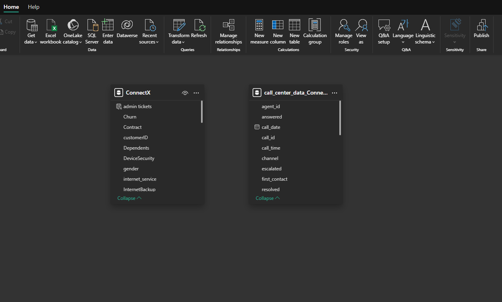

# BOLFUNK-COMMUNICATION
## INTRODUCTION
This Power BI project is focused on analysing customer churn and call centre performance for BOLFUNK COMMUNICATION, a telecom and SaaS provider. The project aims to uncover actionable insights from customer behaviour and support data to enable proactive retention strategies and service quality improvements.
### Disclaimer
All datasets and reports are for demonstration purposes only and do not represent any real company or customer.
## Skills/Concepts Demonstrated:
The following Power BI skills and concepts were applied:
  * DAX Measures and Calculated Columns
  * Data Cleaning and Transformation
  * KPI Cards
  * Slicers and Filters
  * Interactive Visuals
  * Dashboard Design
  * Trend Analysis
## Problem Statement
BOLFUNK is facing rising churn, especially among long-tenured and high-value customers. Despite capturing call center data, they lack real-time insight into emerging churn signals and service gaps.
### Key questions addressed:
1.	Which customers are at the highest risk of churning?
2.	How effective is the call center in resolving customer issues?
3.	What agent-level trends exist in satisfaction and performance?
4.	Which segments (e.g., tenure, contract type, payment method) show the highest churn?
### Modelling:
* The data model includes two independent datasets:
  +	CustomerData (tenure, contract, churn, service usage)
  +	CallCenterData (satisfaction, resolution, escalation, topic, agent)
*	No common key was found; each dataset was analyzed separately.
*	Calculated tables, new columns, and DAX measures were used to enhance the datasets.
  .
 ## Data Preparation
Performed in Power BI using Power Query and the data model:
* Removed duplicates and corrected inconsistent values.
*	Transformed columns (e.g., converted tenure to numeric).
*	Created logical DAX columns
  
*	Built metrics for:
  + Churn Rate
  + Risk Score (0–6 scale)
  + Escalation Rate
  + Average Satisfaction
  + Resolution Rates

